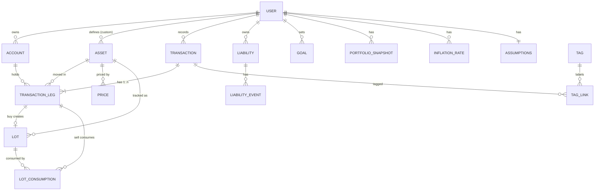

# DATA_MODEL — مدل داده

> قاعده: موجودی، سود/زیان و ارزش خالص هرگز ذخیره‌ی دستی نمی‌شوند؛ از `transactions` مشتق می‌شوند.
> همه‌ی مقادیر مالی `NUMERIC(38,18)` (مطابق CLAUDE.md §۴). همه‌ی جداول کاربری `user_id` و `deleted_at` دارند.

## نمودار موجودیت‌ها (ERD)



## جداول

### user
`id, email (unique), password_hash, display_name, created_at, deleted_at`

### account
`id, user_id, name, type (bank|exchange|brokerage|wallet|physical|property|other), currency_hint, note, created_at, deleted_at`

### asset
`id, user_id (nullable → null یعنی سیستمی/مشترک), symbol, name, asset_class (enum), unit (gram|share|coin|unit|currency_code), quote_currency, is_active, created_at, deleted_at`
- دارایی‌های فیات (IRR, USD, EUR) هم رکورد asset با `asset_class='fiat'` و `unit=currency_code` هستند.
- ملک: یک asset با `asset_class='real_estate'`, `unit='unit'`, معمولاً مقدار ۱ یا درصد مالکیت.

### transaction
`id, user_id, type (enum از GLOSSARY), occurred_at (UTC), note, status (active|reversed), reversal_of (nullable), created_at, deleted_at`

### transaction_leg
`id, transaction_id, account_id, asset_id, quantity (signed Decimal), unit_price (nullable), price_currency (nullable), fee (nullable), fee_currency (nullable)`
- منفی = خروج از حساب، مثبت = ورود.
- `trade` دو پایه دارد؛ نرخ تبدیل ضمنی از نسبت دو پایه/قیمت‌ها به‌دست می‌آید.
- `transfer` دو پایه‌ی هم‌asset در دو account.

### lot  (مبنای FIFO)
`id, user_id, account_id, asset_id, source_leg_id, original_qty, remaining_qty, unit_cost, cost_currency, unit_cost_usd, unit_cost_irr, acquired_at, created_at`
- با هر پایه‌ی افزایشیِ دارایی غیرنقدی ساخته می‌شود.
- `unit_cost_usd/irr` با نرخ ارز تاریخِ خرید ثبت می‌شود (snapshot)، تا گزارش دوگانه پایدار بماند.

### lot_consumption
`id, lot_id, sell_leg_id, qty_consumed, proceeds_unit_price, proceeds_currency, realized_pnl_irr, realized_pnl_usd, consumed_at`
- موقع فروش، لات‌های همان (account, asset) به‌ترتیب `acquired_at` صعودی مصرف می‌شوند.
- سود/زیان محقق‌شده‌ی هر مصرف = (قیمت فروش − قیمت لات) × مقدار، در هر دو ارز.

### price
`id, user_id, asset_id, quote_currency, price (Decimal), as_of (date), source ('manual'), created_at`
- نرخ USD/IRR: رکوردی با `asset = USD`, `quote_currency = IRR`.
- تبدیل هر مبلغ: نزدیک‌ترین price با `as_of <= تاریخ هدف`.

### liability
`id, user_id, name, type (loan|mortgage|installment|credit|other), principal, currency, interest_rate, start_date, term_months, schedule_json, created_at, deleted_at`

### liability_event
`id, liability_id, type (disbursement|repayment|interest), amount, currency, occurred_at, principal_component, interest_component, created_at`
- مانده‌ی بدهی = اصل + بهره‌های شناسایی‌شده − بازپرداخت‌ها (مشتق‌شده).

### goal
`id, user_id, type (target_net_worth|target_return|target_allocation|custom), title, target_value, currency, target_allocation_json (nullable), target_date, status (active|achieved|archived), created_at, deleted_at`
- پیشرفت مشتق‌شده؛ ذخیره نمی‌شود.

### portfolio_snapshot
`id, user_id, as_of (date), total_assets_irr, total_assets_usd, total_liabilities_irr, total_liabilities_usd, net_worth_irr, net_worth_usd, breakdown_json (per class/account), created_at`
- توسط job دوره‌ای (روزانه) ساخته می‌شود؛ مبنای نمودار زمانی.

### inflation_rate
`id, user_id, period_year, period_month, rate (Decimal), source, created_at`

### assumptions
`id, user_id, display_currency (irr|usd|both), hurdle_mode (fixed|inflation|usd_growth), hurdle_fixed_rate, growth_assumptions_json (per asset_class), updated_at`

### tag / tag_link
`tag(id, user_id, name)` , `tag_link(id, tag_id, transaction_id)`

### audit_log
`id, user_id, entity_type, entity_id, action (create|update|reverse|delete), diff_json, occurred_at`

## منطق کلیدی (شبه‌کد)

### محاسبه‌ی موجودی (derived)
```
holding(account, asset) = Σ quantity از transaction_leg
   WHERE account_id, asset_id, transaction.status='active', deleted_at IS NULL
```

### فروش با FIFO
```
remaining = sell_qty
for lot in open_lots(account, asset) ordered by acquired_at ASC:
    take = min(remaining, lot.remaining_qty)
    realized_irr = (sell_price_irr - lot.unit_cost_irr) * take
    realized_usd = (sell_price_usd - lot.unit_cost_usd) * take
    create lot_consumption(...)
    lot.remaining_qty -= take
    remaining -= take
    if remaining == 0: break
assert remaining == 0   # وگرنه فروش بیشتر از موجودی → خطای اعتبارسنجی
```

### ارزش خالص در تاریخ T
```
assets_value = Σ holding(asset) * price(asset, T)   # در هر ارز جدا
liabilities  = Σ outstanding_balance(liability, T)
net_worth    = assets_value - liabilities
```

### بازدهی و تورم
- `xirr` روی لیست جریان‌های نقدی (واریز−، برداشت+، ارزش نهایی+) با ریشه‌یابی نرخ.
- `twr` با شکستن دوره در هر جریان نقدی بیرونی و ضرب بازده زیردوره‌ها.
- `real_return = (1 + nominal) / (1 + inflation) − 1`.
- مقایسه: `nominal` و `real` و `usd-based` در برابر `hurdle_rate`.
